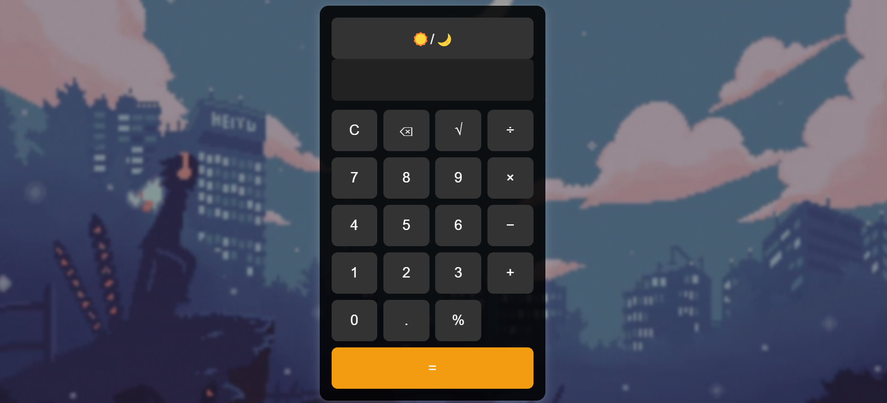

 # 🖩 Basic Calculator

A simple and interactive calculator built using **HTML, CSS, and JavaScript**. This project is designed to perform basic arithmetic operations with a **modern UI** and **light/dark mode toggle**.

## 🌟 Features
- ✅ Basic arithmetic operations: **Addition (+), Subtraction (-), Multiplication (×), Division (÷), Percentage (%)**.
- ✅ **Keyboard Support** – Type numbers and press `Enter` to calculate.
- ✅ **Clear (`C`) & Backspace (`⌫`) Buttons** for easy corrections.
- ✅ **Square Root (`√`) Function** for quick calculations.
- ✅ **Light & Dark Mode** toggle for better usability.
- ✅ **Mobile-Friendly & Responsive** design.
- ✅ **Error Handling** (e.g., division by zero).

## 📷 Screenshot (Optional)
You can add a screenshot of your calculator UI by uploading an image to your repository and adding:
```md

